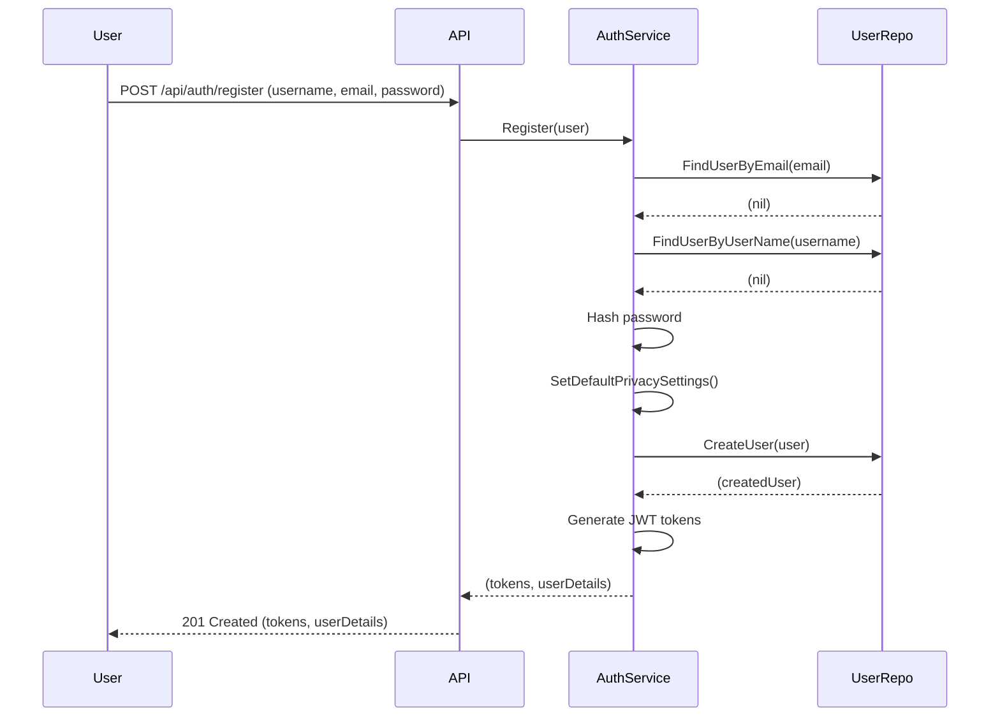
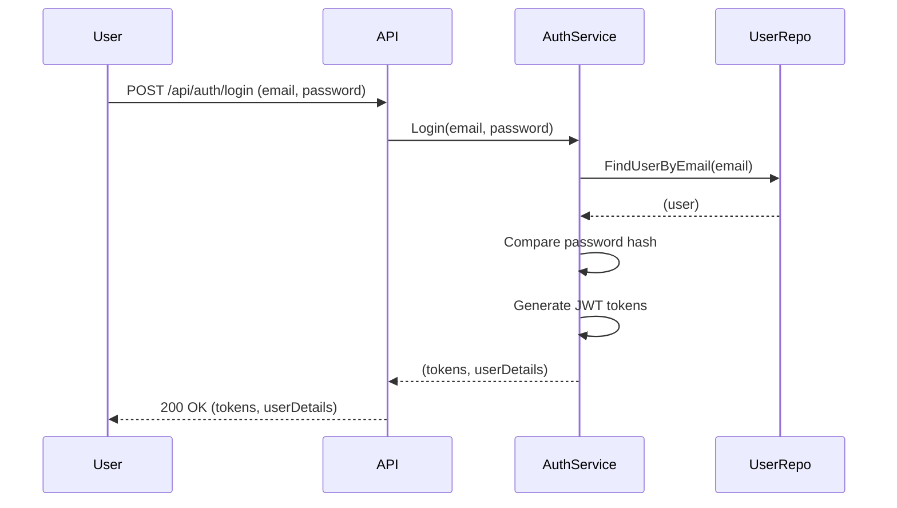
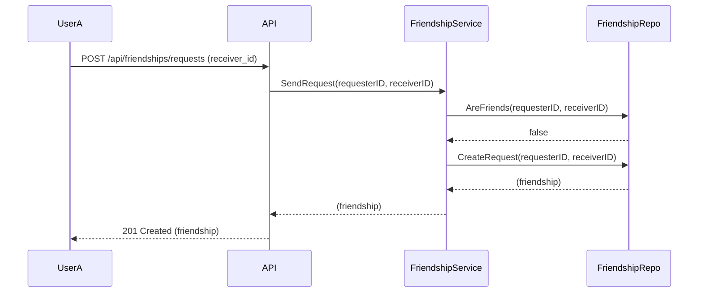
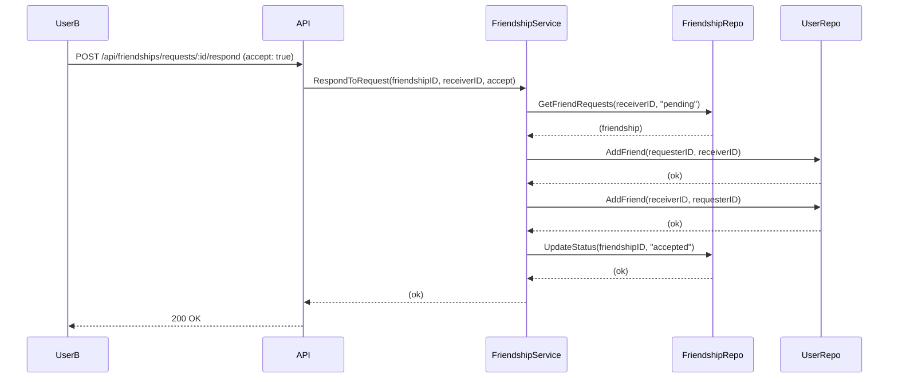
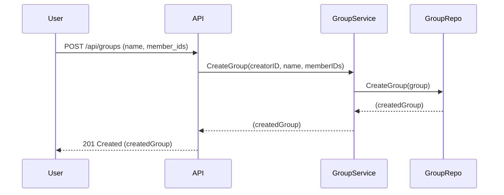
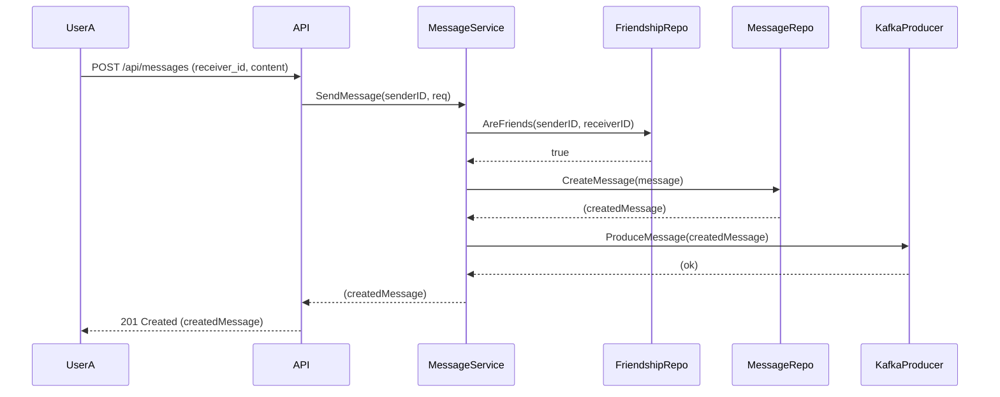
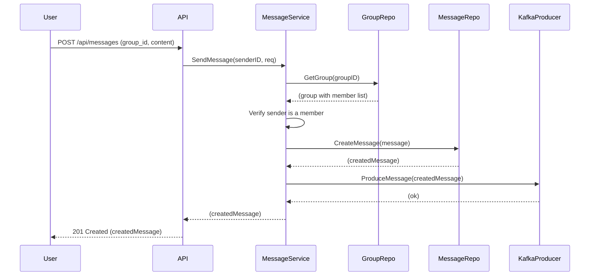
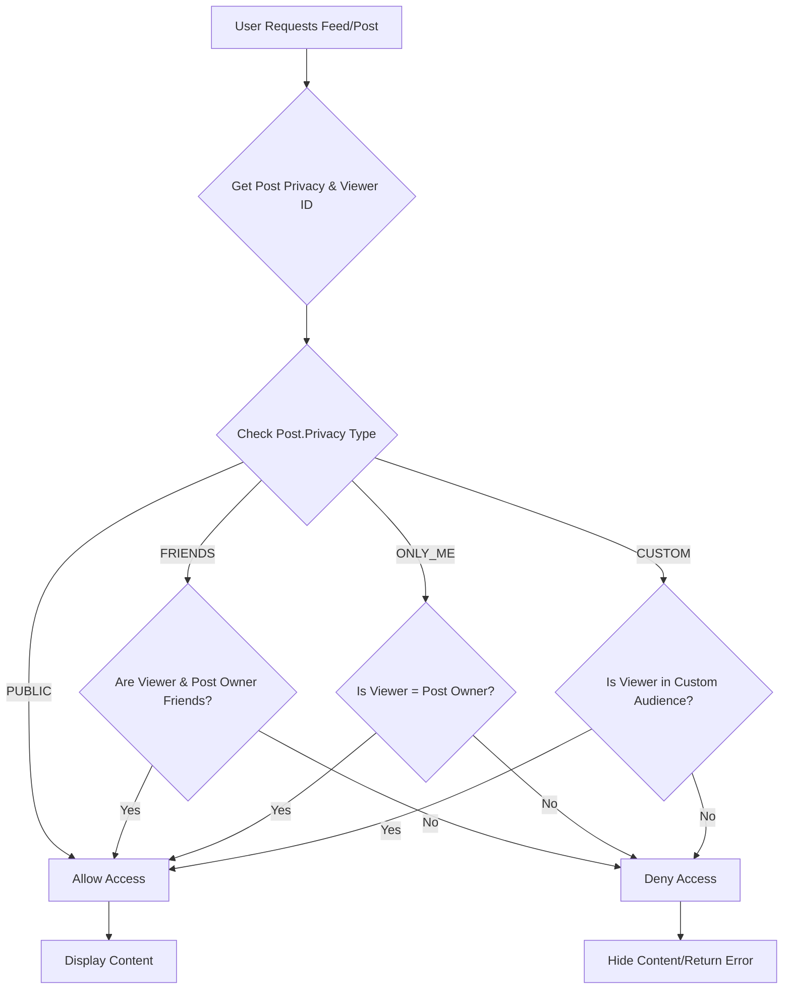
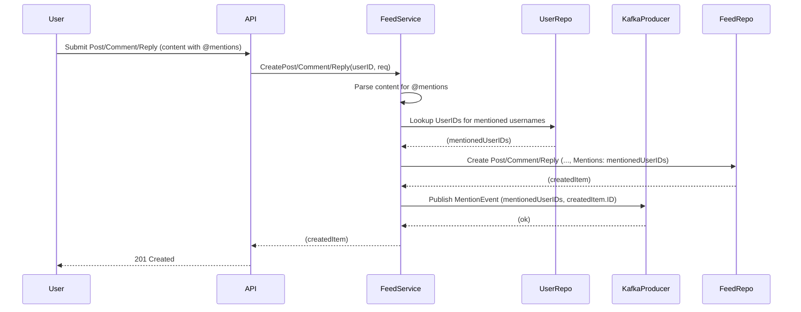

# Business Logic and User Stories

This document outlines the core business logic of the messaging application through user stories and scenarios.

## 1. Authentication

### 1.1. User Registration

*   **As a** new user
*   **I want to** create an account
*   **So that** I can start using the messaging application.

**Scenario:**
*   A new user provides their username, email, and password.
*   The system checks if the email or username is already in use.
*   If not, it hashes the password and creates a new user in the database.
*   The system generates and returns JWT access and refresh tokens.
*   **New:** Default privacy settings are applied to the new user's profile.



### 1.2. User Login

*   **As an** existing user
*   **I want to** log in to my account
*   **So that** I can access my messages and contacts.

**Scenario:**
*   An existing user provides their email and password.
*   The system finds the user by email.
*   It compares the provided password with the stored hash.
*   If the credentials are correct, it generates and returns new JWT access and refresh tokens.



## 2. Friendship Management

### 2.1. Send Friend Request

*   **As a** user
*   **I want to** send a friend request to another user
*   **So that** we can become friends and send messages to each other.

**Scenario:**
*   User A sends a request to become friends with User B.
*   The system checks if they are already friends or if a request is already pending.
*   If not, it creates a new friendship record with a "pending" status.



### 2.2. Respond to Friend Request

*   **As a** user
*   **I want to** accept or reject a friend request
*   **So that** I can control who is in my friends list.

**Scenario:**
*   User B receives a friend request from User A.
*   User B can choose to accept or reject the request.
*   If accepted, the friendship status is updated to "accepted", and both users are added to each other's friend lists.
*   If rejected, the status is updated to "rejected".



## 3. Group Management

### 3.1. Create a Group

*   **As a** user
*   **I want to** create a group with other users
*   **So that** we can have a group conversation.

**Scenario:**
*   A user provides a group name and a list of member IDs.
*   The system creates a new group, setting the creator as the first admin.
*   The creator and all specified members are added to the group's member list.



## 4. Messaging

### 4.1. Send a Direct Message

*   **As a** user
*   **I want to** send a message to a friend
*   **So that** we can communicate privately.

**Scenario:**
*   User A sends a message to User B, who is on their friend list.
*   The system verifies that they are friends.
*   The message is saved to the database.
*   The message is published to a Kafka topic for real-time delivery.



### 4.2. Send a Group Message

*   **As a** user
*   **I want to** send a message to a group
*   **So that** all members of the group can see it.

**Scenario:**
*   A user sends a message to a group they are a member of.
*   The system verifies that the sender is a member of the group.
*   The message is saved to the database.
*   The message is published to a Kafka topic, which will be consumed and distributed to all group members via WebSocket.



## 5. User Privacy Settings

### 5.1. Overview

User privacy settings allow users to control the visibility of their content and interactions within the application. These settings are applied by default during user registration and can be updated by the user at any time.

**Key Components:**

*   **`UserPrivacySettings` Struct:** Defines various privacy preferences for a user.
    ```go
    type UserPrivacySettings struct {
        UserID                  primitive.ObjectID `bson:"user_id" json:"user_id"`
        DefaultPostPrivacy      PrivacySettingType `bson:"default_post_privacy" json:"default_post_privacy"`
        CanSeeMyFriendsList     PrivacySettingType `bson:"can_see_my_friends_list" json:"can_see_my_friends_list"`
        CanSendMeFriendRequests PrivacySettingType `bson:"can_send_me_friend_requests" json:"can_send_me_friend_requests"`
        CanTagMeInPosts         PrivacySettingType `bson:"can_tag_me_in_posts" json:"can_tag_me_in_posts"`
        LastUpdated             time.Time          `bson:"last_updated" json:"last_updated"`
    }
    ```

*   **`PrivacySettingType` Enum:** Defines the possible privacy levels.
    ```go
    type PrivacySettingType string

    const (
        PrivacySettingPublic           PrivacySettingType = "PUBLIC"
        PrivacySettingFriends          PrivacySettingType = "FRIENDS"
        PrivacySettingOnlyMe           PrivacySettingType = "ONLY_ME"
        PrivacySettingFriendsOfFriends PrivacySettingType = "FRIENDS_OF_FRIENDS"
        PrivacySettingNoOne            PrivacySettingType = "NO_ONE"
        PrivacySettingEveryone         PrivacySettingType = "EVERYONE"
    )
    ```

### 5.2. Default Privacy Settings

*   **As a** new user
*   **I want** my privacy settings to be pre-configured with sensible defaults
*   **So that** I don't have to manually set them up immediately.

**Logic:**
When a new user registers, the `SetDefaultPrivacySettings()` method is called on the `User` object within the `AuthService`. This method initializes the `PrivacySettings` field of the `User` struct with predefined values (e.g., `DefaultPostPrivacy` to `PUBLIC`, `CanSeeMyFriendsList` to `FRIENDS`).

### 5.3. Updating Privacy Settings

*   **As a** user
*   **I want to** be able to change my privacy settings
*   **So that** I can control who sees my content and how others interact with me.

**Logic:**
Users can update their privacy settings via the `PUT /api/user/privacy` endpoint. The `FeedController` receives the request, and the `FeedService` updates the corresponding fields in the `User`'s `PrivacySettings` document in the database. Only the fields provided in the request body are updated.

## 6. Feed Management

### 6.1. Posts

Posts are the primary content units in the feed. They can include text, media, mentions, and hashtags, and have configurable privacy settings.

**Key Components:**

*   **`Post` Struct:** Represents a user's post.
    ```go
    type Post struct {
        ID          primitive.ObjectID   `bson:"_id,omitempty" json:"id"`
        UserID      primitive.ObjectID   `bson:"user_id" json:"user_id"`
        Content     string               `bson:"content" json:"content"`
        MediaType   string               `bson:"media_type,omitempty" json:"media_type,omitempty"`
        MediaURL    string               `bson:"media_url,omitempty" json:"media_url,omitempty"`
        Privacy     PrivacySettingType   `bson:"privacy" json:"privacy"`
        CustomAudience []primitive.ObjectID `bson:"custom_audience,omitempty" json:"custom_audience,omitempty"`
        Likes       []primitive.ObjectID `bson:"likes" json:"likes"`
        Comments    []Comment            `bson:"comments" json:"comments"`
        Mentions    []primitive.ObjectID `bson:"mentions,omitempty" json:"mentions,omitempty"`
        Hashtags    []string             `bson:"hashtags,omitempty" json:"hashtags,omitempty"`
        CreatedAt   time.Time            `bson:"created_at" json:"created_at"`
        UpdatedAt   time.Time            `bson:"updated_at" json:"updated_at"`
    }
    ```

*   **Post Creation (`POST /api/posts`):**
    *   A user creates a post with content, optional media, privacy settings, and mentions/hashtags.
    *   The `FeedService` handles the creation, setting `CreatedAt` and `UpdatedAt` timestamps.

*   **Post Retrieval (`GET /api/posts/{id}`):**
    *   Retrieves a single post by its ID.

*   **Post Update (`PUT /api/posts/{id}`):**
    *   Allows the post owner to update content, media, or privacy settings.

*   **Post Deletion (`DELETE /api/posts/{id}`):**
    *   Allows the post owner to delete their post.

### 6.2. Comments

Comments allow users to respond to posts.

**Key Components:**

*   **`Comment` Struct:** Represents a comment on a post.
    ```go
    type Comment struct {
        ID        primitive.ObjectID   `bson:"_id,omitempty" json:"id"`
        PostID    primitive.ObjectID   `bson:"post_id" json:"post_id"`
        UserID    primitive.ObjectID   `bson:"user_id" json:"user_id"`
        Content   string               `bson:"content" json:"content"`
        Likes     []primitive.ObjectID `bson:"likes" json:"likes"`
        Replies   []Reply              `bson:"replies" json:"replies"`
        Mentions  []primitive.ObjectID `bson:"mentions,omitempty" json:"mentions,omitempty"`
        CreatedAt time.Time            `bson:"created_at" json:"created_at"`
        UpdatedAt time.Time            `bson:"updated_at" json:"updated_at"`
    }
    ```

*   **Comment Creation (`POST /api/comments`):**
    *   Users can add comments to existing posts.
    *   The comment is linked to its parent post via `PostID`.

*   **Comment Update (`PUT /api/comments/{id}`):**
    *   Allows the comment owner to modify their comment.

*   **Comment Deletion (`DELETE /api/posts/{postId}/comments/{commentId}`):**
    *   Allows the comment owner to delete their comment.

*   **Retrieving Comments (`GET /api/posts/{postId}/comments`):**
    *   Fetches all comments for a given post.

### 6.3. Replies

Replies allow users to respond to comments, creating threaded conversations.

**Key Components:**

*   **`Reply` Struct:** Represents a reply to a comment.
    ```go
    type Reply struct {
        ID        primitive.ObjectID   `bson:"_id,omitempty" json:"id"`
        CommentID primitive.ObjectID   `bson:"comment_id" json:"comment_id"`
        UserID    primitive.ObjectID   `bson:"user_id" json:"user_id"`
        Content   string               `bson:"content" json:"content"`
        Likes     []primitive.ObjectID `bson:"likes" json:"likes"`
        Mentions  []primitive.ObjectID `bson:"mentions,omitempty" json:"mentions,omitempty"`
        CreatedAt time.Time            `bson:"created_at" json:"created_at"`
        UpdatedAt time.Time            `bson:"updated_at" json:"updated_at"`
    }
    ```

*   **Reply Creation (`POST /api/comments/{commentId}/replies`):**
    *   Users can add replies to existing comments.
    *   The reply is linked to its parent comment via `CommentID`.

*   **Reply Update (`PUT /api/comments/{commentId}/replies/{replyId}`):**
    *   Allows the reply owner to modify their reply.

*   **Reply Deletion (`DELETE /api/comments/{commentId}/replies/{replyId}`):**
    *   Allows the reply owner to delete their reply.

*   **Retrieving Replies (`GET /api/comments/{commentId}/replies`):**
    *   Fetches all replies for a given comment.

### 6.4. Reactions

Reactions allow users to express sentiment towards posts, comments, or replies.

**Key Components:**

*   **`Reaction` Struct:** Represents a reaction.
    ```go
    type Reaction struct {
        ID           primitive.ObjectID `bson:"_id,omitempty" json:"id"`
        UserID       primitive.ObjectID `bson:"user_id" json:"user_id"`
        TargetID     primitive.ObjectID `bson:"target_id" json:"target_id"`
        TargetType   string             `bson:"target_type" json:"target_type"`
        Type         ReactionType       `bson:"type" json:"type"`
        CreatedAt    time.Time          `bson:"created_at" json:"created_at"`
    }
    ```

*   **`ReactionType` Enum:** Defines the types of reactions (e.g., LIKE, LOVE, HAHA).
    ```go
    type ReactionType string

    const (
        ReactionLike ReactionType = "LIKE"
        ReactionLove ReactionType = "LOVE"
        ReactionHaha ReactionType = "HAHA"
        ReactionWow  ReactionType = "WOW"
        ReactionSad  ReactionType = "SAD"
        ReactionAngry ReactionType = "ANGRY"
    )
    ```

*   **Reaction Creation (`POST /api/reactions`):**
    *   Users can add reactions to posts, comments, or replies.
    *   The reaction is linked to its target via `TargetID` and `TargetType`.

*   **Reaction Deletion (`DELETE /api/reactions/{reactionId}`):**
    *   Allows the reaction owner to remove their reaction.

*   **Retrieving Reactions (`GET /api/posts/{postId}/reactions`, `GET /api/comments/{commentId}/reactions`, `GET /api/replies/{replyId}/reactions`):**
    *   Fetches all reactions for a given post, comment, or reply.

### 6.5. Privacy Enforcement (Conceptual)

While the `Privacy` field in the `Post` struct and `UserPrivacySettings` allow for defining privacy, the actual enforcement of these rules when fetching content is a critical piece of the business logic.

**Logic (High-Level):**
When a user requests to view a feed or a specific post, the system must:

1.  **Identify Viewer:** Determine the `viewerID` (the ID of the user making the request).
2.  **Retrieve Post Privacy:** Get the `Privacy` setting of the post and, if applicable, its `CustomAudience`.
3.  **Check Relationship:** Based on the post's `Privacy` setting, check the `viewerID`'s relationship with the `post.UserID`:
    *   **`PUBLIC`:** Always visible.
    *   **`FRIENDS`:** Check if `viewerID` and `post.UserID` are friends (using `FriendshipService`).
    *   **`ONLY_ME`:** Only visible if `viewerID` is `post.UserID`.
    *   **`CUSTOM`:** Check if `viewerID` is in the `post.CustomAudience` list.
4.  **Filter Content:** Only return posts that satisfy the privacy criteria. This logic would primarily reside in the `FeedService.ListPosts` method and potentially `FeedService.GetPostByID`.



## 7. Mentions (Conceptual)

Mentions allow users to tag other users in their posts, comments, and replies. While the data models (`Post`, `Comment`, `Reply`) include a `Mentions` field to store the IDs of mentioned users, the full implementation of mention functionality involves additional steps.

**Logic (High-Level):**

1.  **Parsing Mentions:** When a user submits content (post, comment, or reply), the system needs to parse the text content to identify patterns like `@username`.
2.  **Resolving User IDs:** For each identified `@username`, the system must resolve it to a `primitive.ObjectID` by looking up the user in the database.
3.  **Storing Mentions:** The resolved `primitive.ObjectID`s are then stored in the `Mentions` array of the respective `Post`, `Comment`, or `Reply` document.
4.  **Notifications:** A critical part of mentions is notifying the mentioned user. This would involve:
    *   Publishing an event (e.g., to Kafka) when a mention occurs.
    *   A separate notification service consuming these events.
    *   Generating an in-app notification or push notification to the mentioned user.


