# Business Logic Documentation

This document outlines the core business logic and user stories for the messaging application. Each section describes a key feature, including a Mermaid graph to visualize the flow and bullet-point descriptions for each scenario.

## 1. User Management & Authentication

### 1.1 User Registration

A new user signs up for the messaging application.

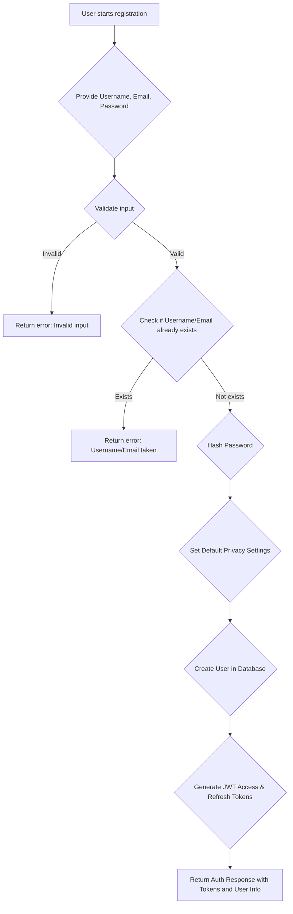

*   **User Initiates Registration**: The user provides a unique username, a valid email address, and a strong password.
*   **Input Validation**: The system validates the format and completeness of the provided data (e.g., email format, password strength).
*   **Uniqueness Check**: The system verifies that the chosen username and email address are not already registered.
*   **Password Hashing**: The provided password is securely hashed using bcrypt before storage.
*   **Default Privacy Settings**: New users are assigned default privacy settings (e.g., public posts, friends can see friend list).
*   **User Creation**: A new user record is created in the database.
*   **Token Generation**: JWT access and refresh tokens are generated for the newly registered user.
*   **Authentication Response**: The system returns the generated tokens and basic user information, indicating successful registration and login.

### 1.2 User Login

An existing user logs into the application.

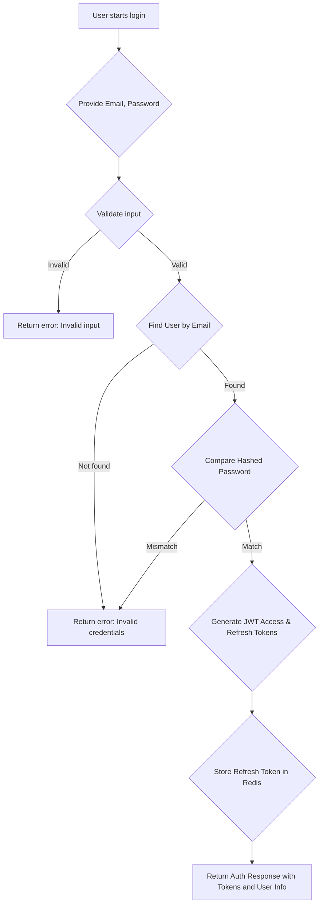

*   **User Initiates Login**: The user provides their registered email address and password.
*   **Input Validation**: The system validates the format of the email and ensures the password field is not empty.
*   **User Lookup**: The system attempts to find a user record matching the provided email address.
*   **Password Verification**: If a user is found, the provided password is compared against the stored hashed password.
*   **Token Generation**: Upon successful password verification, new JWT access and refresh tokens are generated.
*   **Refresh Token Storage**: The refresh token is stored in Redis, associated with the user ID, for future token refreshes.
*   **Authentication Response**: The system returns the generated tokens and basic user information, confirming successful login.

### 1.3 User Logout

A user logs out of the application.

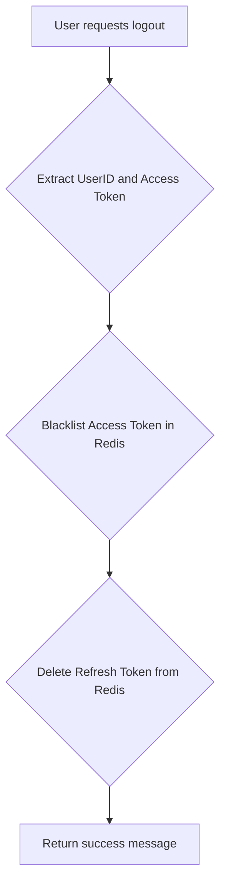

*   **User Initiates Logout**: The user sends a request to log out.
*   **Token Extraction**: The system extracts the user ID from the current access token and the access token itself.
*   **Access Token Blacklisting**: The current access token is added to a Redis blacklist to immediately invalidate it, preventing further use. The blacklist entry has an expiration matching the token's original TTL.
*   **Refresh Token Deletion**: The user's refresh token is removed from Redis, preventing future token refreshes.
*   **Logout Confirmation**: The system returns a success message.

### 1.4 Update User Profile

A user updates their profile information.

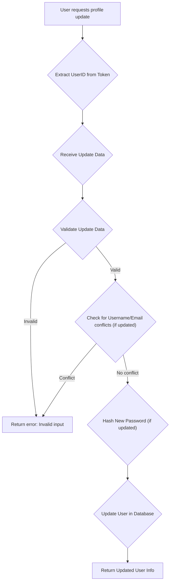

*   **User Initiates Update**: The user sends a request to update their profile, providing fields like username, full name, bio, etc.
*   **User Identification**: The system extracts the user ID from the authentication token.
*   **Data Validation**: The provided update data is validated (e.g., username length, email format).
*   **Conflict Check**: If the username or email is being updated, the system checks for conflicts with existing users.
*   **Password Update (Conditional)**: If the password is being updated, the current password is verified, and the new password is hashed before storage.
*   **Database Update**: The user's profile information is updated in the database.
*   **Updated Profile Return**: The system returns the updated user object (excluding sensitive information like password hash).

### 1.5 Manage Privacy Settings

A user configures their privacy settings.

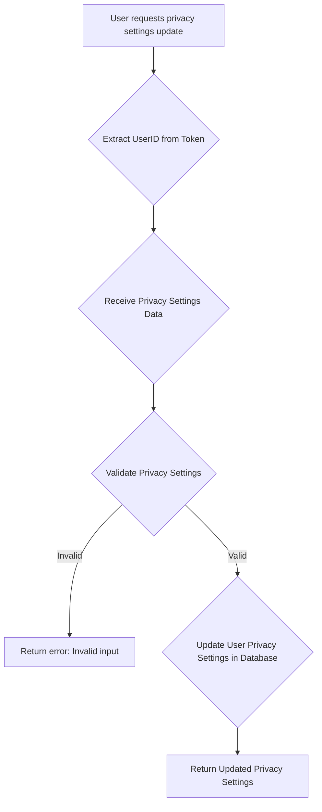

*   **User Initiates Privacy Update**: The user sends a request to modify their privacy settings (e.g., default post privacy, who can see their friends list).
*   **User Identification**: The system extracts the user ID from the authentication token.
*   **Data Validation**: The provided privacy settings are validated against predefined types (e.g., PUBLIC, FRIENDS, ONLY_ME).
*   **Database Update**: The user's privacy settings are updated or created in the database.
*   **Updated Settings Return**: The system returns the user's current privacy settings.

## 2. Friendship Management

### 2.1 Send Friend Request

A user sends a friend request to another user.

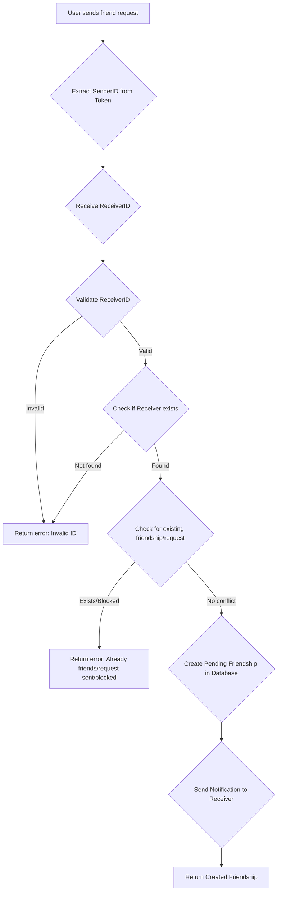

*   **User Initiates Request**: The user sends a request to add another user as a friend.
*   **User Identification**: The system identifies the sender from their authentication token and receives the receiver's ID.
*   **Receiver Validation**: The system validates the receiver's ID and confirms the receiver exists.
*   **Conflict Check**: The system checks if a friendship already exists, a pending request is already sent, or if either user has blocked the other.
*   **Friendship Creation**: A new friendship record with "pending" status is created in the database.
*   **Notification**: A notification is sent to the receiver about the new friend request.
*   **Friendship Return**: The system returns the newly created friendship object.

### 2.2 Respond to Friend Request

A user accepts or rejects a friend request.

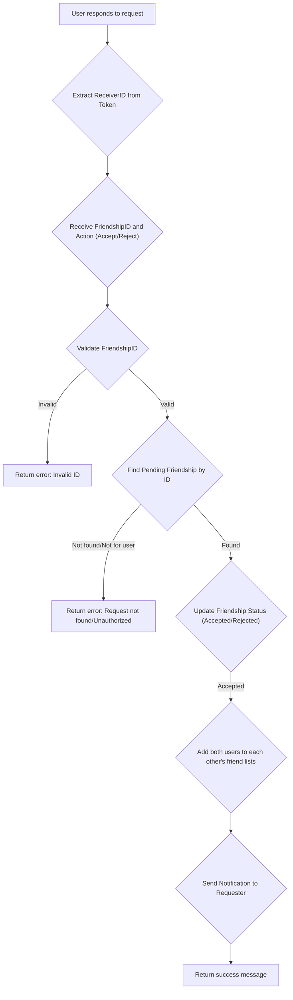

*   **User Initiates Response**: The user sends a request to accept or reject a pending friend request.
*   **User Identification**: The system identifies the receiver (who is responding) from their authentication token and receives the friendship ID and action.
*   **Friendship Validation**: The system validates the friendship ID and ensures the request belongs to the current user and is in a "pending" state.
*   **Status Update**: The friendship status is updated to "accepted" or "rejected" in the database.
*   **Friend List Update (if accepted)**: If accepted, both users' friend lists are updated to include each other.
*   **Notification**: A notification is sent to the original requester about the response.
*   **Response Confirmation**: The system returns a success message.

### 2.3 Unfriend a User

A user removes another user from their friend list.

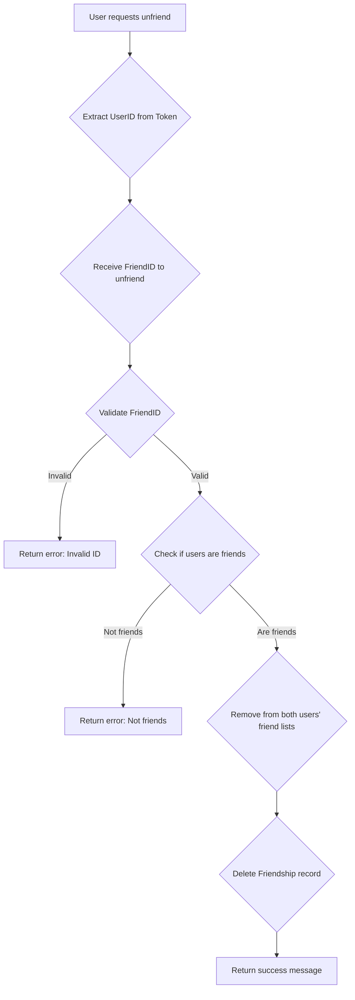

*   **User Initiates Unfriend**: The user sends a request to remove a friend.
*   **User Identification**: The system identifies the current user and the friend to be unfriended.
*   **Friendship Verification**: The system verifies that the two users are indeed friends.
*   **Friend List Update**: Both users' friend lists are updated to remove each other.
*   **Friendship Record Deletion**: The friendship record is deleted from the database.
*   **Response Confirmation**: The system returns a success message.

### 2.4 Block a User

A user blocks another user.

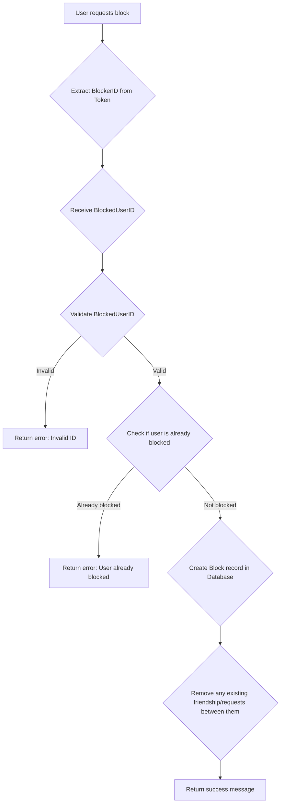

*   **User Initiates Block**: The user sends a request to block another user.
*   **User Identification**: The system identifies the blocker and the user to be blocked.
*   **Blocked User Validation**: The system validates the ID of the user to be blocked.
*   **Existing Block Check**: The system checks if the user is already blocked.
*   **Block Record Creation**: A block record is created in the database.
*   **Friendship/Request Removal**: Any existing friendship or pending friend requests between the two users are removed.
*   **Response Confirmation**: The system returns a success message.

## 3. Group Management

### 3.1 Create Group

A user creates a new group.

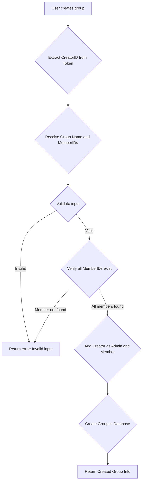

*   **User Initiates Group Creation**: The user provides a group name and a list of member IDs.
*   **User Identification**: The system identifies the creator from their authentication token.
*   **Input Validation**: The group name and member IDs are validated.
*   **Member Verification**: The system verifies that all provided member IDs correspond to existing users.
*   **Creator as Admin/Member**: The creator is automatically added as both an admin and a member of the group.
*   **Group Creation**: A new group record is created in the database.
*   **Group Info Return**: The system returns the details of the newly created group.

### 3.2 Add Member to Group

A group admin adds a new member to a group.

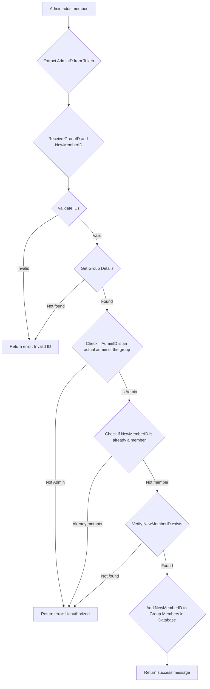

*   **Admin Initiates Add Member**: A group admin sends a request to add a new member.
*   **User Identification**: The system identifies the admin from their authentication token and receives the group ID and the new member's ID.
*   **Group and Member Validation**: The system validates all provided IDs and retrieves group details.
*   **Admin Authorization**: The system verifies that the requesting user is an admin of the specified group.
*   **Membership Check**: The system checks if the user to be added is already a member of the group.
*   **New Member Verification**: The system verifies that the new member ID corresponds to an existing user.
*   **Database Update**: The new member's ID is added to the group's `Members` list in the database.
*   **Response Confirmation**: The system returns a success message.

### 3.3 Add Admin to Group

A group admin promotes a member to an admin.

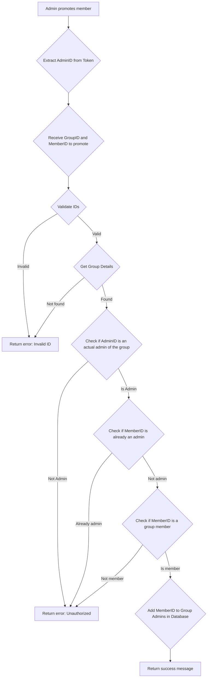

*   **Admin Initiates Promote**: A group admin sends a request to promote an existing member to an admin.
*   **User Identification**: The system identifies the admin from their authentication token and receives the group ID and the member's ID.
*   **Group and Member Validation**: The system validates all provided IDs and retrieves group details.
*   **Admin Authorization**: The system verifies that the requesting user is an admin of the specified group.
*   **Existing Admin Check**: The system checks if the member is already an admin.
*   **Membership Check**: The system verifies that the member to be promoted is indeed a member of the group.
*   **Database Update**: The member's ID is added to the group's `Admins` list in the database.
*   **Response Confirmation**: The system returns a success message.

### 3.4 Remove Member from Group

A group admin removes a member from a group.

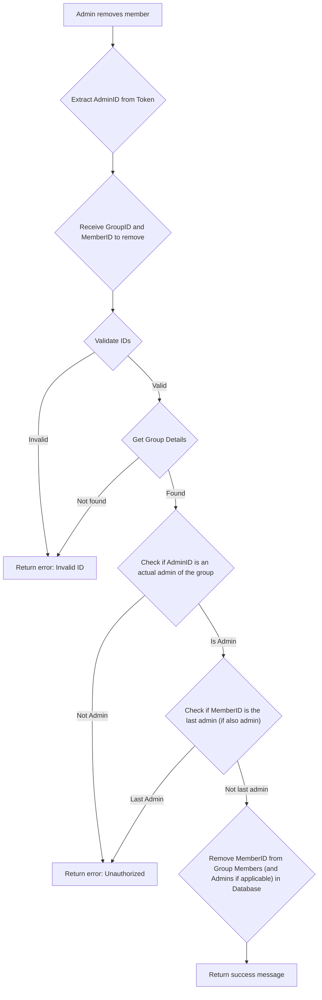

*   **Admin Initiates Remove Member**: A group admin sends a request to remove a member.
*   **User Identification**: The system identifies the admin from their authentication token and receives the group ID and the member's ID.
*   **Group and Member Validation**: The system validates all provided IDs and retrieves group details.
*   **Admin Authorization**: The system verifies that the requesting user is an admin of the specified group.
*   **Last Admin Check**: If the member to be removed is also an admin, the system checks if they are the *last* admin, preventing a group from being left without an admin.
*   **Database Update**: The member's ID is removed from the group's `Members` list (and `Admins` list if applicable) in the database.
*   **Response Confirmation**: The system returns a success message.

## 4. Messaging

### 4.1 Send Direct Message

A user sends a direct message to a friend.


*   **User Initiates Direct Message**: The user provides the receiver's ID and the message content.
*   **User Identification**: The system identifies the sender from their authentication token.
*   **Input Validation**: The message content and receiver ID are validated.
*   **Friendship Check**: The system verifies that the sender and receiver are friends.
*   **Message Creation**: A new message record is created in the database.
*   **Kafka Publication**: The message is published to a Kafka topic for real-time delivery to the receiver via WebSocket.
*   **Redis Cache Update**: The "last message" cache for the conversation is updated in Redis.
*   **Message Return**: The system returns the newly created message object.

### 4.2 Send Group Message

A user sends a message to a group they are a member of.

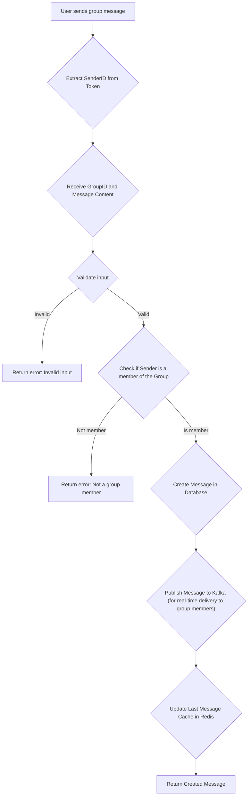

*   **User Initiates Group Message**: The user provides the group ID and the message content.
*   **User Identification**: The system identifies the sender from their authentication token.
*   **Input Validation**: The message content and group ID are validated.
*   **Group Membership Check**: The system verifies that the sender is a member of the specified group (using Redis cache first, then database fallback).
*   **Message Creation**: A new message record is created in the database.
*   **Kafka Publication**: The message is published to a Kafka topic for real-time delivery to all group members via WebSocket.
*   **Redis Cache Update**: The "last message" cache for the group conversation is updated in Redis.
*   **Message Return**: The system returns the newly created message object.

### 4.3 Get Messages (Direct or Group)

A user retrieves messages for a direct conversation or a group.

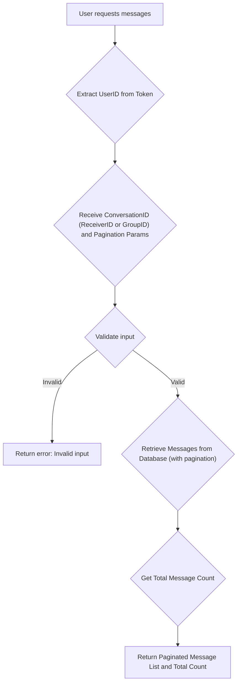

*   **User Initiates Message Retrieval**: The user provides either a `receiverID` (for direct messages) or a `groupID` (for group messages), along with optional pagination parameters (page, limit, before timestamp).
*   **User Identification**: The system identifies the requesting user from their authentication token.
*   **Input Validation**: The conversation ID and pagination parameters are validated.
*   **Message Retrieval**: The system queries the database to retrieve messages for the specified conversation, applying pagination and filtering.
*   **Total Count**: The total count of messages in the conversation is retrieved (using Redis cache first, then database fallback).
*   **Paginated Response**: The system returns a paginated list of messages and the total count.

### 4.4 Mark Messages as Seen

A user marks one or more messages as seen.

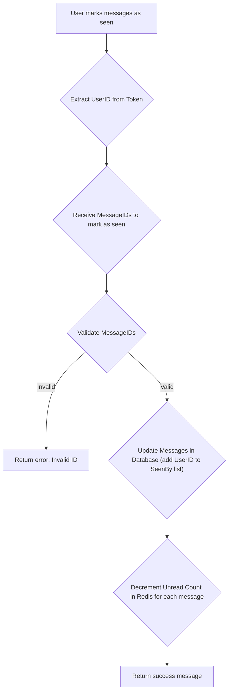

*   **User Initiates Mark as Seen**: The user provides a list of message IDs to be marked as seen.
*   **User Identification**: The system identifies the requesting user from their authentication token.
*   **Message ID Validation**: The provided message IDs are validated.
*   **Database Update**: For each message, the requesting user's ID is added to the `SeenBy` list in the database.
*   **Redis Unread Count Update**: The unread count for the user in Redis is decremented for each marked message.
*   **Response Confirmation**: The system returns a success message.

### 4.5 Get Unread Message Count

A user retrieves their total unread message count.

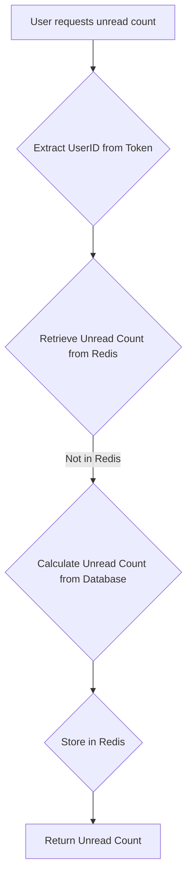

*   **User Initiates Unread Count Request**: The user sends a request to get their total unread message count.
*   **User Identification**: The system identifies the requesting user from their authentication token.
*   **Redis Lookup**: The system first attempts to retrieve the unread count from Redis.
*   **Database Fallback**: If not found in Redis, the system calculates the unread count from the database.
*   **Redis Cache**: The calculated unread count is stored in Redis for future quick retrieval.
*   **Unread Count Return**: The system returns the total unread message count.

### 4.6 Delete Message

A user deletes a message they sent.

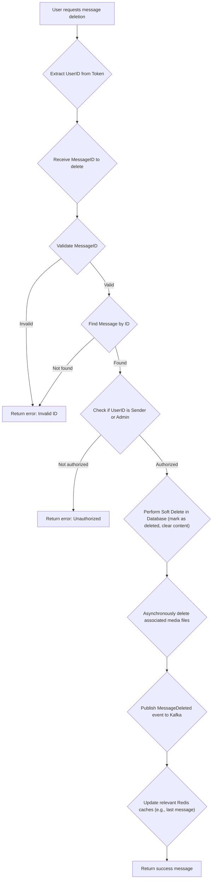

*   **User Initiates Message Deletion**: The user provides the ID of the message to be deleted.
*   **User Identification**: The system identifies the requesting user from their authentication token.
*   **Message Validation**: The message ID is validated, and the message is retrieved from the database.
*   **Authorization Check**: The system verifies that the requesting user is the sender of the message or an authorized admin.
*   **Soft Delete**: The message is soft-deleted in the database (e.g., `is_deleted` flag set to true, content replaced with "message deleted").
*   **Media Deletion (Asynchronous)**: Any media files associated with the message are asynchronously deleted.
*   **Kafka Publication**: A `MessageDeleted` event is published to Kafka to notify other services and clients.
*   **Redis Cache Update**: Relevant Redis caches (e.g., last message in conversation) are updated.
*   **Response Confirmation**: The system returns a success message.

## 5. Feed/Post Management

### 5.1 Create Post

A user creates a new post on their feed.

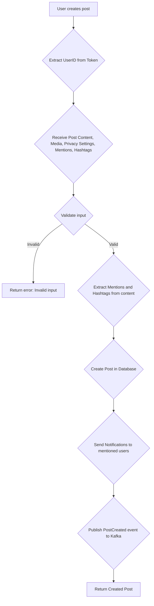

*   **User Initiates Post Creation**: The user provides post content, optional media URLs, privacy settings (Public, Friends, Only Me, Custom), mentions, and hashtags.
*   **User Identification**: The system identifies the author from their authentication token.
*   **Input Validation**: The post content, media, and privacy settings are validated. Mentions are extracted from the content.
*   **Post Creation**: A new post record is created in the database.
*   **Mention Notifications**: Notifications are sent to any users mentioned in the post.
*   **Kafka Publication**: A `PostCreated` event is published to Kafka for real-time feed updates.
*   **Post Return**: The system returns the newly created post object.

### 5.2 Get Post by ID

A user retrieves a specific post by its ID.

```mermaid
graph TD
    A["User requests post by ID"] --> B{"Extract ViewerID from Token"};
    B --> C{"Receive PostID"};
    C --> D{"Validate PostID"};
    D -- "Invalid" --> E["Return error: Invalid ID"];
    D -- "Valid" --> F{"Retrieve Post from Database"};
    F -- "Not found" --> E;
    F -- "Found" --> G{"Check Viewer's Privacy Permissions"};
    G -- "Unauthorized" --> H["Return error: Unauthorized to view post"];
    G -- "Authorized" --> I{"Populate Reaction Counts"};
    I --> J["Return Post Details"];
```

*   **User Initiates Post Retrieval**: The user provides the ID of the post they want to view.
*   **User Identification**: The system identifies the viewer from their authentication token.
*   **Post Validation**: The post ID is validated, and the post is retrieved from the database.
*   **Privacy Check**: The system checks if the viewer has permission to view the post based on its privacy settings (Public, Friends, Only Me, Custom Audience).
*   **Reaction Count Population**: The system populates the reaction counts for the post.
*   **Post Return**: The system returns the details of the requested post.

### 5.3 Update Post

A user updates an existing post.

```mermaid
graph TD
    A["User requests post update"] --> B{"Extract UserID from Token"};
    B --> C{"Receive PostID and Update Data"};
    C --> D{"Validate input"};
    D -- "Invalid" --> E["Return error: Invalid input"];
    D -- "Valid" --> F{"Retrieve Post from Database"};
    F -- "Not found" --> E;
    F -- "Found" --> G{"Check if UserID is Post Owner"};
    G -- "Not Owner" --> H["Return error: Unauthorized"];
    G -- "Is Owner" --> I{"Update Post in Database"};
    I --> J["Return Updated Post"];
```

*   **User Initiates Post Update**: The user provides the post ID and the fields to update (content, media, privacy).
*   **User Identification**: The system identifies the user from their authentication token.
*   **Input Validation**: The update data is validated.
*   **Post Retrieval**: The post is retrieved from the database.
*   **Ownership Check**: The system verifies that the requesting user is the owner of the post.
*   **Database Update**: The post record is updated in the database.
*   **Updated Post Return**: The system returns the updated post object.

### 5.4 Delete Post

A user deletes an existing post.

```mermaid
graph TD
    A["User requests post deletion"] --> B{"Extract UserID from Token"};
    B --> C{"Receive PostID"};
    C --> D{"Validate PostID"};
    D -- "Invalid" --> E["Return error: Invalid ID"];
    D -- "Valid" --> F{"Retrieve Post from Database"};
    F -- "Not found" --> E;
    F -- "Found" --> G{"Check if UserID is Post Owner"};
    G -- "Not Owner" --> H["Return error: Unauthorized"];
    G -- "Is Owner" --> I{"Delete Post from Database"};
    I --> J["Return success message"];
```

*   **User Initiates Post Deletion**: The user provides the ID of the post to be deleted.
*   **User Identification**: The system identifies the user from their authentication token.
*   **Post Validation**: The post ID is validated, and the post is retrieved from the database.
*   **Ownership Check**: The system verifies that the requesting user is the owner of the post.
*   **Database Deletion**: The post record is deleted from the database.
*   **Response Confirmation**: The system returns a success message.

### 5.5 Create Comment

A user creates a new comment on a post.

```mermaid
graph TD
    A["User creates comment"] --> B{"Extract UserID from Token"};
    B --> C{"Receive PostID and Comment Content"};
    C --> D{"Validate input"};
    D -- "Invalid" --> E["Return error: Invalid input"];
    D -- "Valid" --> F{"Check if Post exists"};
    F -- "Not found" --> E;
    F -- "Found" --> G{"Extract Mentions from content"};
    G --> H{"Create Comment in Database"};
    H --> I{"Send Notifications to mentioned users and post owner"};
    I --> J{"Publish CommentCreated event to Kafka"};
    J --> K["Return Created Comment"];
```

*   **User Initiates Comment Creation**: The user provides the post ID and the comment content.
*   **User Identification**: The system identifies the author from their authentication token.
*   **Input Validation**: The comment content and post ID are validated.
*   **Post Existence Check**: The system verifies that the target post exists.
*   **Mention Extraction**: Mentions are extracted from the comment content.
*   **Comment Creation**: A new comment record is created in the database.
*   **Notifications**: Notifications are sent to mentioned users and the owner of the post.
*   **Kafka Publication**: A `CommentCreated` event is published to Kafka for real-time updates.
*   **Comment Return**: The system returns the newly created comment object.

### 5.6 Create Reply

A user creates a new reply to a comment.

```mermaid
graph TD
    A["User creates reply"] --> B{"Extract UserID from Token"};
    B --> C{"Receive CommentID and Reply Content"};
    C --> D{"Validate input"};
    D -- "Invalid" --> E["Return error: Invalid input"];
    D -- "Valid" --> F{"Check if Comment exists"};
    F -- "Not found" --> E;
    F -- "Found" --> G{"Extract Mentions from content"};
    G --> H{"Create Reply in Database"};
    H --> I{"Send Notifications to mentioned users and comment owner"};
    I --> J{"Publish ReplyCreated event to Kafka"};
    J --> K["Return Created Reply"];
```

*   **User Initiates Reply Creation**: The user provides the comment ID and the reply content.
*   **User Identification**: The system identifies the author from their authentication token.
*   **Input Validation**: The reply content and comment ID are validated.
*   **Comment Existence Check**: The system verifies that the target comment exists.
*   **Mention Extraction**: Mentions are extracted from the reply content.
*   **Reply Creation**: A new reply record is created in the database.
*   **Notifications**: Notifications are sent to mentioned users and the owner of the comment.
*   **Kafka Publication**: A `ReplyCreated` event is published to Kafka for real-time updates.
*   **Reply Return**: The system returns the newly created reply object.

### 5.7 Create Reaction

A user reacts to a post, comment, or reply.

```mermaid
graph TD
    A["User creates reaction"] --> B{"Extract UserID from Token"};
    B --> C{"Receive TargetID, TargetType, and ReactionType"};
    C --> D{"Validate input"};
    D -- "Invalid" --> E["Return error: Invalid input"];
    D -- "Valid" --> F{"Check if Target (Post/Comment/Reply) exists"};
    F -- "Not found" --> E;
    F -- "Found" --> G{"Create Reaction in Database"};
    G --> H{"Send Notification to Target Owner"};
    H --> I{"Publish ReactionCreated event to Kafka"};
    I --> J["Return Created Reaction"];
```

*   **User Initiates Reaction**: The user provides the ID of the target (post, comment, or reply), its type, and the reaction type (e.g., LIKE, LOVE).
*   **User Identification**: The system identifies the user from their authentication token.
*   **Input Validation**: The target ID, type, and reaction type are validated.
*   **Target Existence Check**: The system verifies that the target (post, comment, or reply) exists.
*   **Reaction Creation**: A new reaction record is created in the database.
*   **Notification**: A notification is sent to the owner of the target (post, comment, or reply).
*   **Kafka Publication**: A `ReactionCreated` event is published to Kafka for real-time updates.
*   **Reaction Return**: The system returns the newly created reaction object.
