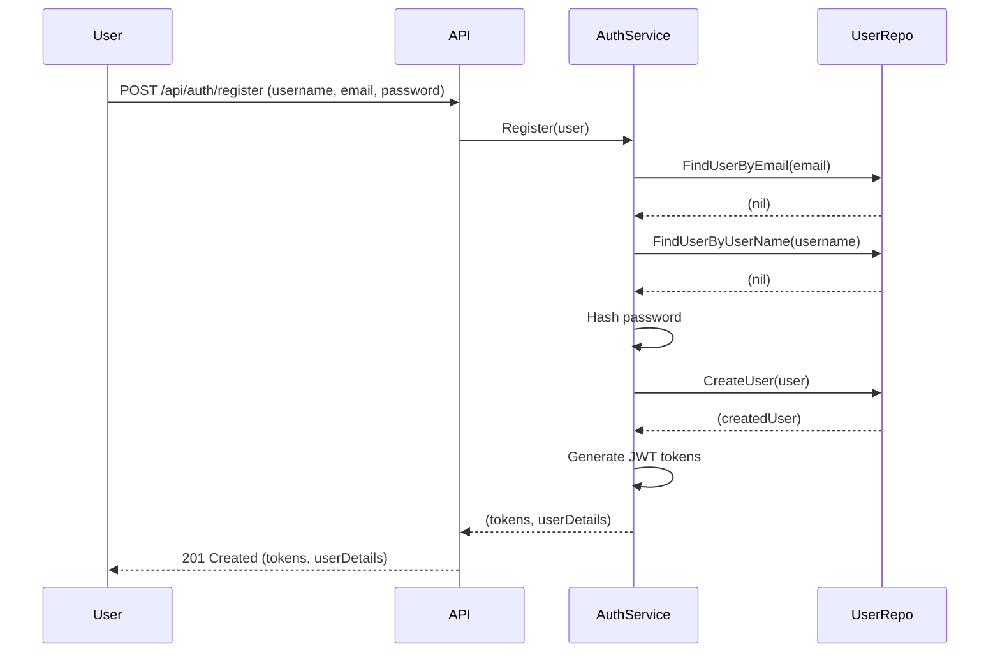
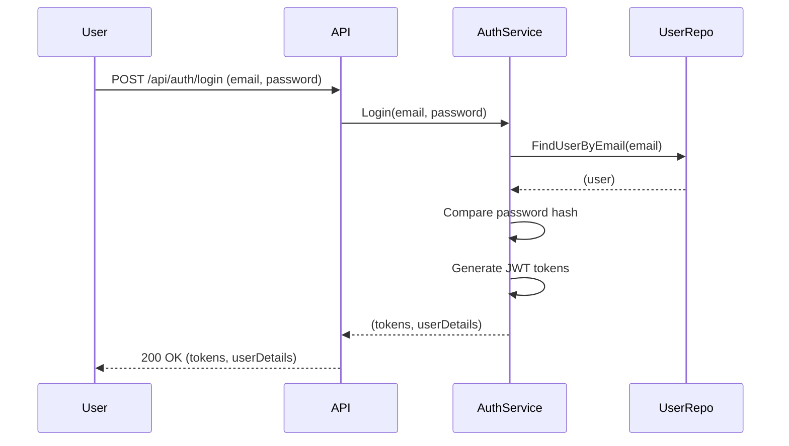
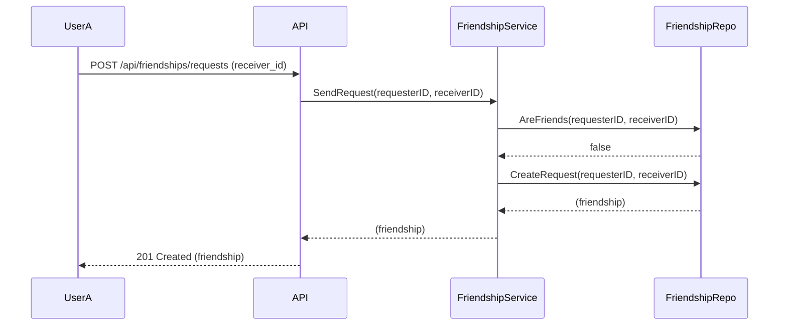
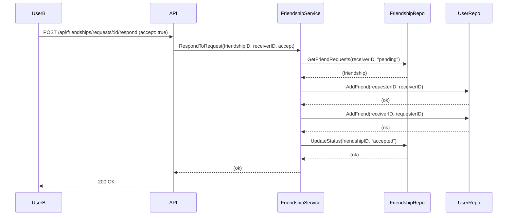
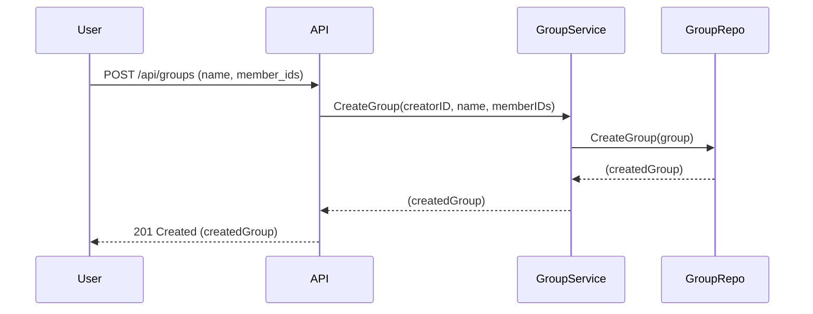
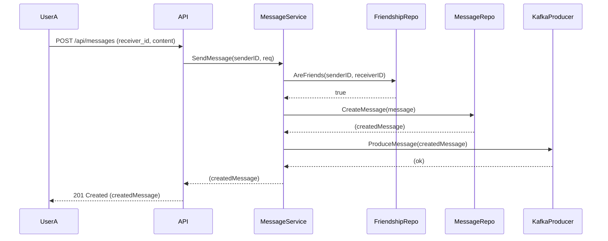
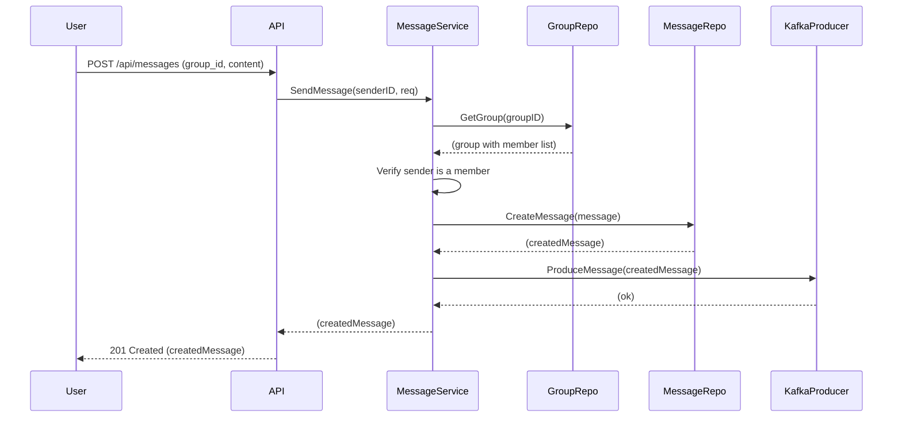

# Business Logic and User Stories

This document outlines the core business logic of the messaging application through user stories and scenarios.

## 1. Authentication

### 1.1. User Registration

*   **As a** new user
*   **I want to** create an account
*   **So that** I can start using the messaging application.

**Scenario:**
*   A new user provides their username, email, and password.
*   The system checks if the email or username is already in use.
*   If not, it hashes the password and creates a new user in the database.
*   The system generates and returns JWT access and refresh tokens.

### 1.2. User Login

*   **As an** existing user
*   **I want to** log in to my account
*   **So that** I can access my messages and contacts.

**Scenario:**
*   An existing user provides their email and password.
*   The system finds the user by email.
*   It compares the provided password with the stored hash.
*   If the credentials are correct, it generates and returns new JWT access and refresh tokens.

## 2. Friendship Management

### 2.1. Send Friend Request

*   **As a** user
*   **I want to** send a friend request to another user
*   **So that** we can become friends and send messages to each other.

**Scenario:**
*   User A sends a request to become friends with User B.
*   The system checks if they are already friends or if a request is already pending.
*   If not, it creates a new friendship record with a "pending" status.

### 2.2. Respond to Friend Request

*   **As a** user
*   **I want to** accept or reject a friend request
*   **So that** I can control who is in my friends list.

**Scenario:**
*   User B receives a friend request from User A.
*   User B can choose to accept or reject the request.
*   If accepted, the friendship status is updated to "accepted", and both users are added to each other's friend lists.
*   If rejected, the status is updated to "rejected".

## 3. Group Management

### 3.1. Create a Group

*   **As a** user
*   **I want to** create a group with other users
*   **So that** we can have a group conversation.

**Scenario:**
*   A user provides a group name and a list of member IDs.
*   The system creates a new group, setting the creator as the first admin.
*   The creator and all specified members are added to the group's member list.

## 4. Messaging

### 4.1. Send a Direct Message

*   **As a** user
*   **I want to** send a message to a friend
*   **So that** we can communicate privately.

**Scenario:**
*   User A sends a message to User B, who is on their friend list.
*   The system verifies that they are friends.
*   The message is saved to the database.
*   The message is published to a Kafka topic for real-time delivery.

### 4.2. Send a Group Message

*   **As a** user
*   **I want to** send a message to a group
*   **So that** all members of the group can see it.

**Scenario:**
*   A user sends a message to a group they are a member of.
*   The system verifies that the sender is a member of the group.
*   The message is saved to the database.
*   The message is published to a Kafka topic, which will be consumed and distributed to all group members via WebSocket.

